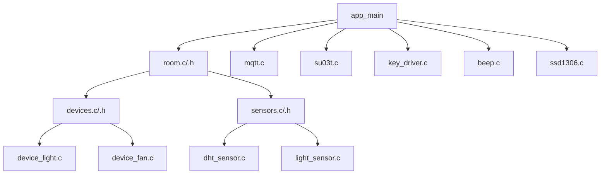

# 智能房间控制系统

## 项目简介

本项目是基于ESP32的智能房间控制系统，实现了多种模式切换（HOME/AWAY/SLEEP）、设备控制（灯光、风扇）、环境传感器采集（温湿度、光照）、语音识别控制、按键输入处理、OLED显示及Wi-Fi和MQTT网络通信功能。

系统通过模块化设计，结构清晰，易于扩展和维护。

------

## 目录结构

```
├── main/
│   └── main.c             // 程序入口，调用所有初始化
├── common/
│   └── common.h           // 全局配置和宏定义（模式、控制方式、MQTT参数等）
├── room/
│   ├── room.c             // 模式切换控制器（HOME/AWAY/SLEEP）
│   └── room.h
├── devices/
│   ├── devices.c          // 灯光、风扇设备控制封装
│   ├── devices.h
│   ├── device_light.c     // 灯光控制实现
│   └── device_fan.c       // 风扇控制实现
├── sensors/
│   ├── sensors.c          // 传感器初始化与任务创建
│   ├── sensors.h
│   ├── dht_sensor.c       // DHT11/DHT22 温湿度采集
│   └── light_sensor.c     // 光照传感器采集
├── peripherals/
│   ├── su03t.c            // 语音识别模块（串口指令）
│   ├── beep.c             // 蜂鸣器控制
│   ├── key_driver.c       // 按键输入逻辑
│   └── ssd1306.c          // OLED 显示
├── network/
│   ├── wifi_connect.c     // Wi-Fi连接逻辑
│   └── mqtt.c             // MQTT连接、发布与订阅
```

------

## 系统架构图



------

## 功能说明

- **模式切换（room模块）**
  支持三种房间模式：HOME、AWAY、SLEEP。不同模式下设备和传感器行为不同。
- **设备控制（devices模块）**
  控制灯光和风扇，支持开关及状态反馈。
- **传感器采集（sensors模块）**
  采集温湿度（DHT11/DHT22）和环境光照强度数据。
- **语音识别（peripherals/su03t模块）**
  通过串口通信控制语音识别模块，实现语音命令控制。
- **按键输入（peripherals/key_driver模块）**
  实现多按键事件检测与处理。
- **OLED显示（peripherals/ssd1306模块）**
  显示房间状态、传感器数据等信息。
- **网络通信（network模块）**
  通过Wi-Fi连接路由器，使用MQTT协议实现远程控制和状态发布。

------

## 依赖环境

- ESP-IDF v5.2.0
- ESP32 开发板
- DHT11/DHT22 传感器
- SSD1306 OLED 显示屏
- SU03T 语音识别模块
- MQTT Broker（如：Mosquitto）

------

## 快速开始

### 1. 环境准备

- 安装并配置ESP-IDF开发环境
- 连接ESP32开发板

### 2. 配置网络参数

在 `common/common.h` 里配置：

```c
#define WIFI_SSID       "你的WiFi名称"
#define WIFI_PASSWORD   "你的WiFi密码"
#define MQTT_BROKER_URI "mqtt://broker.hivemq.com"
#define MQTT_CLIENT_ID  "esp32_room_control"
```

### 3. 编译与烧录

```bash
idf.py build
idf.py flash monitor
```

### 4. 功能测试

- 通过语音切换房间模式
  - 说“启动回家模式|我回来了” → 进入 HOME 模式，灯光开启，风扇根据环境调整
  - 说“启动离家模式|我要去玩了” → 进入 AWAY 模式，关闭大部分设备以节能
  - 说“启动睡觉模式|我想睡觉了” → 进入 SLEEP 模式，调整灯光亮度及风扇状态
- 观察OLED显示当前模式和传感器数据
- 通过MQTT客户端订阅/发布对应主题，实现远程控制
- 通过语音模块发送指令，验证语音控制功能

------

## 代码说明

- `main.c`
  程序入口，负责初始化各模块和启动任务。
- `room.c`
  管理房间当前模式，触发设备状态切换。
- `devices.c` & 相关文件
  实现设备控制逻辑，包括灯光和风扇的开关控制。
- `sensors.c` & 相关文件
  初始化传感器，创建采集任务，并将数据传递给显示和网络模块。
- `wifi_connect.c`
  负责Wi-Fi连接管理，断线重连。
- `mqtt.c`
  管理MQTT客户端，消息订阅和发布。
- `su03t.c`
  语音识别模块通信，解析指令。
- `key_driver.c`
  按键扫描和事件分发。
- `beep.c`
  蜂鸣器控制。
- `ssd1306.c`
  OLED显示控制。

------

## 常见问题

- **设备无法连接Wi-Fi**
  检查SSID和密码配置是否正确，确认路由器状态。
- **MQTT消息无法收发**
  确认Broker地址及端口，检查网络连通性。
- **传感器数据异常**
  检查传感器连接线及接口，确认采集频率合理。

------

## 贡献指南

欢迎提交 Issue 和 Pull Request。请确保代码风格统一，功能模块单一，提交前通过编译和基本测试。

------

## 联系方式

作者：李龙华
 邮箱：[1651300994@qq.com](1651300994@qq.com)
 GitHub：[https://github.com/yourusername/esp32-room-control](https://github.com/IntelligentServiceLab/SmartHome)

------

